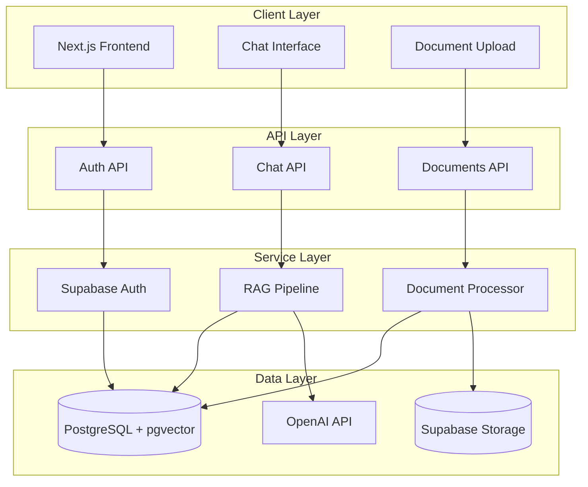
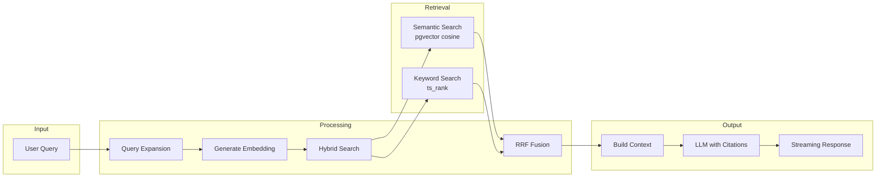
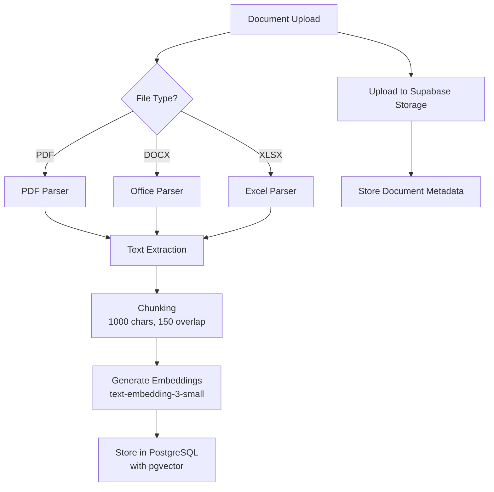
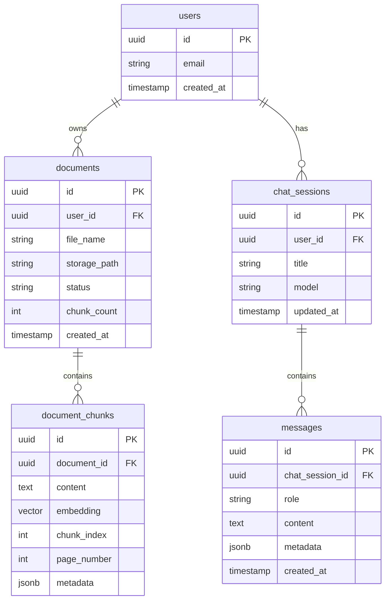

# Legal AI Assistant

A production-ready RAG (Retrieval-Augmented Generation) based legal document Q&A system. Upload your legal documents and get intelligent, citation-backed answers grounded in your content.

## Features

- **Document Upload & Processing** - Support for PDF, DOCX, XLSX, and other formats
- **Hybrid Search** - Combines semantic vector search with keyword matching using RRF fusion
- **Citation-Backed Answers** - Responses include numbered citations to source documents with page numbers
- **Multi-User Support** - Full authentication with document isolation per user
- **Streaming Responses** - Real-time LLM responses via Server-Sent Events
- **PDF Preview** - In-app document viewing with navigation to cited sections

## Tech Stack

| Layer | Technology |
|-------|------------|
| Frontend | Next.js 14 (App Router), React 18, TailwindCSS, shadcn/ui |
| Backend | Next.js API Routes, TypeScript |
| Database | PostgreSQL with pgvector extension |
| Auth | Supabase Auth |
| Storage | Supabase Storage |
| Vector Search | pgvector with hybrid search (semantic + keyword) |
| LLM | OpenAI GPT-4o / GPT-4o-mini |
| Embeddings | OpenAI text-embedding-3-small (1536 dimensions) |
| Deployment | Netlify with SSR support |

## Architecture

### System Overview



### RAG Pipeline



### Document Processing Flow



### Database Schema



## Project Structure

```
tax_research/
├── nextjs_space/              # Main application
│   ├── app/                   # Next.js App Router
│   │   ├── api/               # Backend API routes
│   │   │   ├── chat/          # Chat + RAG endpoint
│   │   │   ├── documents/     # Document management
│   │   │   └── auth/          # Authentication
│   │   ├── dashboard/         # Protected pages
│   │   ├── login/             # Auth pages
│   │   └── signup/
│   ├── components/            # React components
│   │   └── ui/                # shadcn/ui components
│   ├── lib/                   # Business logic
│   │   ├── supabase-rag.ts    # RAG system (hybrid search, embeddings)
│   │   ├── supabase-db.ts     # Database operations
│   │   ├── supabase-auth.ts   # Auth utilities
│   │   ├── supabase-storage.ts # File storage
│   │   └── document-processor.ts # Document parsing
│   └── utils/                 # Utilities
│       └── supabase/          # Supabase client setup
├── research/                  # Architecture research & documentation
├── netlify.toml               # Netlify deployment config
└── README.md
```

## Getting Started

### Prerequisites

- Node.js 20+
- PostgreSQL with pgvector extension
- Supabase project (or self-hosted)
- OpenAI API key

### Installation

1. **Clone the repository**
   ```bash
   git clone https://github.com/avinish1992/tax_research.git
   cd tax_research/nextjs_space
   ```

2. **Install dependencies**
   ```bash
   npm install --legacy-peer-deps
   ```

3. **Configure environment variables**

   Create `.env.local` in the `nextjs_space` directory:
   ```env
   # Supabase
   NEXT_PUBLIC_SUPABASE_URL=your_supabase_url
   NEXT_PUBLIC_SUPABASE_ANON_KEY=your_anon_key
   SUPABASE_SERVICE_ROLE_KEY=your_service_role_key

   # OpenAI
   OPENAI_API_KEY=your_openai_api_key

   # App
   NEXT_PUBLIC_APP_URL=http://localhost:3000
   ```

4. **Set up the database**

   Run the following SQL in your Supabase SQL editor:
   ```sql
   -- Enable pgvector extension
   CREATE EXTENSION IF NOT EXISTS vector;

   -- Create tables (see Database Schema section)
   -- Run the hybrid_search and semantic_search RPC functions
   ```

5. **Start development server**
   ```bash
   npm run dev
   ```

   Open [http://localhost:3000](http://localhost:3000)

### Deployment

The application is configured for Netlify deployment:

```bash
# Build locally
npm run build

# Deploy via Netlify CLI
netlify deploy --prod
```

Or connect your GitHub repository to Netlify for automatic deployments.

## RAG Configuration

Key parameters in `lib/supabase-rag.ts`:

| Parameter | Value | Description |
|-----------|-------|-------------|
| `EMBEDDING_MODEL` | text-embedding-3-small | 1536-dimensional embeddings |
| `DEFAULT_TOP_K` | 50 | Initial retrieval count |
| `FINAL_TOP_K` | 20 | Results after RRF fusion |
| `DEFAULT_MIN_SIMILARITY` | 0.25 | Minimum cosine similarity threshold |
| `semantic_weight` | 0.6 | Weight for semantic search in RRF |
| `keyword_weight` | 0.4 | Weight for keyword search in RRF |
| `rrf_k` | 60 | RRF fusion constant |

## API Endpoints

| Endpoint | Method | Description |
|----------|--------|-------------|
| `/api/auth/callback` | GET | OAuth callback handler |
| `/api/chat` | POST | Send message, get RAG-enhanced response |
| `/api/documents/upload` | POST | Upload and process document |
| `/api/documents/[id]` | GET/DELETE | Get or delete document |
| `/api/chat-sessions` | GET/POST | List or create chat sessions |

## License

MIT

## Contributing

1. Fork the repository
2. Create a feature branch (`git checkout -b feature/amazing-feature`)
3. Commit changes (`git commit -m 'Add amazing feature'`)
4. Push to branch (`git push origin feature/amazing-feature`)
5. Open a Pull Request
