# Knowledge Architecture for Legal AI Assistant

**Version:** 1.0
**Date:** 2025-12-18
**Status:** Research & Design

---

## Table of Contents

1. [Executive Summary](#executive-summary)
2. [Academic Research Synthesis](#academic-research-synthesis)
3. [The Interplay: Vector DB ↔ Knowledge Graph ↔ Ontology](#the-interplay)
4. [Layered System Architecture](#layered-system-architecture)
5. [Component Deep Dive](#component-deep-dive)
6. [Tooling Decisions Matrix](#tooling-decisions-matrix)
7. [MVP vs Scale Architecture](#mvp-vs-scale-architecture)
8. [Implementation Roadmap](#implementation-roadmap)

---

## Executive Summary

This document defines the knowledge architecture for the Legal AI Assistant, synthesizing latest academic research (2024-2025) on hybrid RAG systems that combine:

- **Vector Databases** - Semantic similarity search
- **Knowledge Graphs** - Relational reasoning & multi-hop queries
- **Ontologies** - Domain schema & constraint enforcement
- **Memory Systems** - Personalization & context continuity

### Key Architectural Decisions

| Component | MVP Choice | Rationale | Scale Path |
|-----------|------------|-----------|------------|
| **Document Parsing** | Docling + LlamaParse | 97.9% table accuracy, OSS | Keep |
| **Vector Store** | pgvector (Supabase) | Integrated, RLS | Qdrant |
| **Knowledge Graph** | Skip | Not needed for MVP queries | LightRAG |
| **Ontology** | Lightweight taxonomy | Query expansion, metadata | OG-RAG |
| **Memory** | Short-term only | Simple session context | Mem0 |

---

## Academic Research Synthesis

### 1. HybridRAG: The State of the Art (2024-2025)

**Source:** [arXiv:2408.04948](https://arxiv.org/abs/2408.04948)

> "HybridRAG outperforms both traditional VectorRAG and GraphRAG individually when evaluated at both the retrieval and generation stages."

**Key Insight:** Neither vector search nor graph traversal alone is optimal. The hybrid approach:
1. Uses vector search for initial candidate retrieval (speed)
2. Applies graph reasoning for relationship validation (accuracy)
3. Combines results through learned fusion

```
┌─────────────────────────────────────────────────────────────────┐
│                    HybridRAG Architecture                       │
├─────────────────────────────────────────────────────────────────┤
│                                                                 │
│   Query ──► Embedding ──► Vector Search ──┐                    │
│                                           │                     │
│   Query ──► Entity Extract ──► Graph ────┼──► RRF Fusion ──► LLM
│                              Traversal   │                     │
│                                           │                     │
│   Query ──► Keyword Match ───────────────┘                    │
│                                                                 │
└─────────────────────────────────────────────────────────────────┘
```

### 2. OG-RAG: Ontology-Grounded RAG (EMNLP 2025)

**Source:** [ACL Anthology](https://aclanthology.org/2025.emnlp-main.1674/)

> "OG-RAG constructs a hypergraph representation of domain documents, where each hyperedge encapsulates clusters of factual knowledge grounded using domain-specific ontology."

**Key Insight:** Ontologies aren't just for schema definition—they improve retrieval by:
1. Grounding document chunks to ontological concepts
2. Creating semantic clusters (hyperedges) that capture related facts
3. Enabling structured navigation through domain knowledge

**Performance:** Significant improvements on domain-specific QA benchmarks over vanilla RAG.

### 3. Legal Knowledge Graphs Research

**Sources:**
- [MDPI - Legal KG with LLMs](https://www.mdpi.com/2078-2489/15/11/666)
- [Springer - Legal KG Query System](https://link.springer.com/chapter/10.1007/978-981-96-5881-7_13)

**Key Findings for Legal Domain:**

| Aspect | Finding |
|--------|---------|
| **Entity Types** | Laws, sections, clauses, parties, obligations, rights |
| **Relation Types** | references, supersedes, conflicts_with, governed_by |
| **Use Cases** | Cross-referencing, compliance checking, precedent analysis |
| **LLM Integration** | GPT-4 achieves F1 76.76 on legal entity extraction |

### 4. MemoRAG: Memory-Augmented RAG (2025)

**Source:** [arXiv:2409.05591](https://arxiv.org/abs/2409.05591)

> "MemoRAG achieves superior performances across a variety of long-context evaluation tasks with 91% lower p95 latency."

**Key Insight:** Memory augmentation addresses RAG limitations:
1. **KV Compression** - Efficient long-context handling
2. **Global Memory** - Cross-document reasoning
3. **RLGF Training** - Learning from generation feedback

### 5. Agentic RAG: Multi-Agent Architectures

**Source:** [arXiv:2501.09136](https://arxiv.org/abs/2501.09136)

> "Agentic RAG incorporates goal reasoning and self-direction, enabling AI systems to make informed decisions based on user context and intent."

**Key Components:**
- **Router Agent** - Query classification & routing
- **Retrieval Agents** - Specialized per data source
- **Synthesis Agent** - Multi-source answer generation
- **Verification Agent** - Fact-checking & hallucination detection

---

## The Interplay: Vector DB ↔ Knowledge Graph ↔ Ontology

### Conceptual Framework

```
┌─────────────────────────────────────────────────────────────────────────────┐
│                     KNOWLEDGE REPRESENTATION LAYERS                          │
├─────────────────────────────────────────────────────────────────────────────┤
│                                                                              │
│  ONTOLOGY LAYER (Schema & Constraints)                                       │
│  ════════════════════════════════════                                        │
│  • Defines WHAT entities exist (Contract, Clause, Party, Obligation)        │
│  • Defines HOW they relate (contains, references, obligates)                │
│  • Enforces domain rules (a Clause must belong to exactly one Contract)     │
│  • Provides query expansion vocabulary (NDA = Non-Disclosure Agreement)     │
│                                                                              │
│         │                                                                    │
│         ▼                                                                    │
│  KNOWLEDGE GRAPH LAYER (Instances & Relations)                               │
│  ═════════════════════════════════════════════                               │
│  • Stores SPECIFIC instances (Contract_123, Clause_456)                     │
│  • Captures relationships between instances                                  │
│  • Enables multi-hop traversal ("What clauses reference Section 5.2?")      │
│  • Supports complex queries across documents                                 │
│                                                                              │
│         │                                                                    │
│         ▼                                                                    │
│  VECTOR DATABASE LAYER (Semantic Embeddings)                                 │
│  ═══════════════════════════════════════════                                 │
│  • Stores text chunks as high-dimensional vectors                           │
│  • Enables fuzzy semantic matching ("liability" ≈ "responsibility")         │
│  • Fast approximate nearest neighbor search                                  │
│  • No explicit structure—purely statistical similarity                       │
│                                                                              │
│         │                                                                    │
│         ▼                                                                    │
│  MEMORY LAYER (Context & Personalization)                                    │
│  ════════════════════════════════════════                                    │
│  • Short-term: Current conversation context                                  │
│  • Episodic: Past interactions ("We discussed this contract last week")     │
│  • Semantic: Learned facts about user/domain                                │
│  • Temporal: Time-indexed changes and events                                 │
│                                                                              │
└─────────────────────────────────────────────────────────────────────────────┘
```

### When Each Layer Excels

| Query Type | Best Layer | Why |
|------------|------------|-----|
| "What does Section 3.2 say about termination?" | Vector DB | Direct semantic match |
| "List all contracts with Company X" | Knowledge Graph | Entity-based query |
| "What clauses conflict with our standard NDA?" | KG + Ontology | Multi-hop + constraint checking |
| "Explain indemnification in simple terms" | Ontology + Vector | Concept definition + context |
| "What did we discuss about this contract before?" | Memory | Episodic recall |
| "How has this regulation changed over time?" | Memory (Temporal) | Time-indexed events |

### The Hybrid Pipeline (Research-Based)

Based on [HybridRAG](https://arxiv.org/abs/2408.04948) and [OG-RAG](https://aclanthology.org/2025.emnlp-main.1674/):

```
┌─────────────────────────────────────────────────────────────────────────────┐
│                         HYBRID RETRIEVAL PIPELINE                            │
├─────────────────────────────────────────────────────────────────────────────┤
│                                                                              │
│                           ┌──────────────┐                                  │
│                           │  User Query  │                                  │
│                           └──────┬───────┘                                  │
│                                  │                                          │
│                    ┌─────────────┼─────────────┐                           │
│                    ▼             ▼             ▼                            │
│            ┌─────────────┐ ┌─────────────┐ ┌─────────────┐                 │
│            │  Ontology   │ │   Query     │ │   Entity    │                 │
│            │  Expansion  │ │  Embedding  │ │ Extraction  │                 │
│            └──────┬──────┘ └──────┬──────┘ └──────┬──────┘                 │
│                   │              │              │                           │
│            ┌──────▼──────┐ ┌─────▼──────┐ ┌─────▼──────┐                  │
│            │  Keyword    │ │  Vector    │ │   Graph    │                   │
│            │  Search     │ │  Search    │ │  Traversal │                   │
│            │  (BM25)     │ │  (HNSW)    │ │  (Cypher)  │                   │
│            └──────┬──────┘ └─────┬──────┘ └─────┬──────┘                   │
│                   │              │              │                           │
│                   └──────────────┼──────────────┘                          │
│                                  │                                          │
│                           ┌──────▼───────┐                                 │
│                           │  RRF Fusion  │                                 │
│                           │  (k=60)      │                                 │
│                           └──────┬───────┘                                 │
│                                  │                                          │
│                           ┌──────▼───────┐                                 │
│                           │   Reranker   │                                 │
│                           │  (Cohere/    │                                 │
│                           │Cross-Encoder)│                                 │
│                           └──────┬───────┘                                 │
│                                  │                                          │
│                           ┌──────▼───────┐                                 │
│                           │    LLM       │                                 │
│                           │  Generation  │                                 │
│                           │  + Citations │                                 │
│                           └──────────────┘                                 │
│                                                                              │
└─────────────────────────────────────────────────────────────────────────────┘
```

---

## Layered System Architecture

### Complete System Diagram

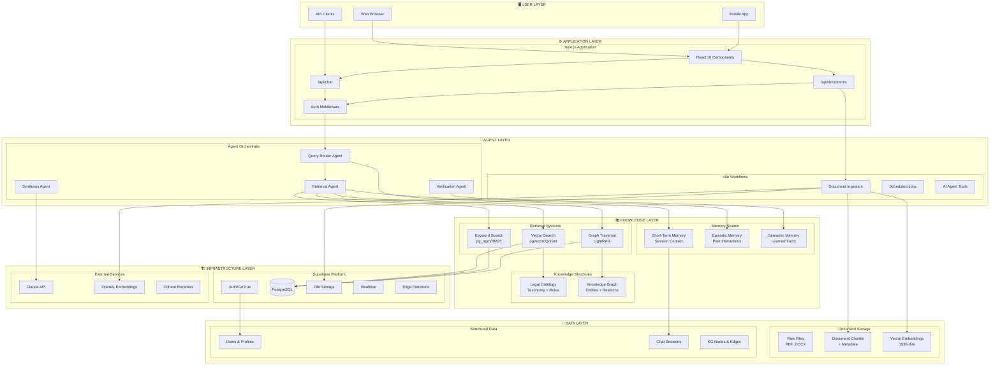

### Layer Responsibilities

#### 1. User Layer
- **What it does:** Presentation and user interaction
- **Components:** Web browser, mobile apps, API integrations
- **Key concern:** Responsive, accessible interface

#### 2. Application Layer
- **What it does:** Request handling, routing, authentication
- **Components:** Next.js pages, API routes, middleware
- **Key concern:** Low latency, proper auth, streaming responses

#### 3. Agent Layer
- **What it does:** Intelligent query processing and orchestration
- **Components:**
  - **Router Agent** - Classifies queries, selects retrieval strategy
  - **Retrieval Agent** - Executes hybrid search across all sources
  - **Synthesis Agent** - Generates coherent responses with citations
  - **Verification Agent** - Fact-checks, detects hallucinations
- **Key concern:** Accuracy, reasoning, explainability

#### 4. Knowledge Layer
- **What it does:** Information storage and retrieval
- **Sub-layers:**
  - **Retrieval Systems** - Vector, keyword, and graph-based search
  - **Knowledge Structures** - Ontology definitions, knowledge graph
  - **Memory System** - Short-term, episodic, semantic memory
- **Key concern:** Comprehensive coverage, fast retrieval

#### 5. Infrastructure Layer
- **What it does:** Platform services and external integrations
- **Components:** Supabase (auth, db, storage), LLM APIs, embedding APIs
- **Key concern:** Reliability, security, cost efficiency

#### 6. Data Layer
- **What it does:** Persistent storage of all data
- **Components:** Raw files, processed chunks, vectors, structured data
- **Key concern:** Integrity, backup, RLS security

---

## Component Deep Dive

### Document Ingestion Pipeline

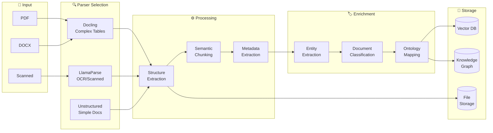

### Hybrid Search Architecture

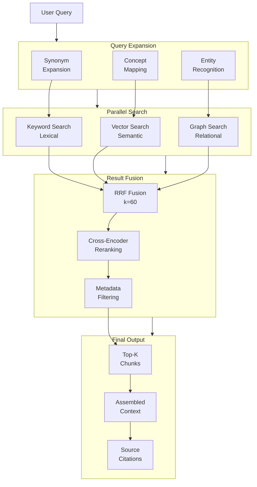

### Memory Architecture

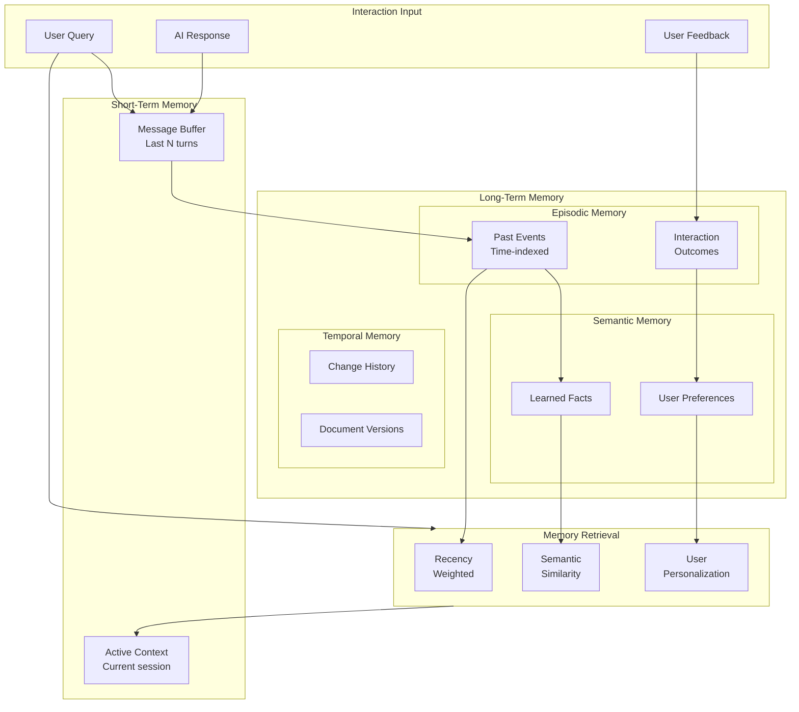

---

## Tooling Decisions Matrix

### What Each Tool Solves

```
┌─────────────────────────────────────────────────────────────────────────────┐
│                        TOOLING DECISIONS MATRIX                              │
├─────────────────────────────────────────────────────────────────────────────┤
│                                                                              │
│  PROBLEM                    │ TOOL              │ WHY THIS TOOL              │
│  ════════════════════════════════════════════════════════════════════════   │
│                                                                              │
│  DOCUMENT PARSING                                                           │
│  ─────────────────                                                          │
│  Complex tables in PDFs     │ Docling           │ 97.9% accuracy, OSS        │
│  Scanned/OCR documents      │ LlamaParse        │ Best OCR, fast (~6s)       │
│  Simple docs, fallback      │ Unstructured      │ LangChain integration      │
│                                                                              │
│  VECTOR STORAGE                                                             │
│  ──────────────                                                             │
│  MVP (<100K docs)           │ pgvector          │ Integrated with Supabase   │
│  Scale (>1M docs)           │ Qdrant            │ Purpose-built, faster      │
│  Multi-modal                │ Milvus            │ Image+text embeddings      │
│                                                                              │
│  KNOWLEDGE GRAPH                                                            │
│  ──────────────                                                             │
│  Skip for MVP               │ None              │ Not needed for basic QA    │
│  Lightweight graphs         │ LightRAG          │ 6000x cheaper than GraphRAG│
│  Full graph reasoning       │ Neo4j + GraphRAG  │ Enterprise multi-hop       │
│                                                                              │
│  ONTOLOGY                                                                   │
│  ────────                                                                   │
│  Query expansion            │ Simple taxonomy   │ YAML/JSON, easy to edit    │
│  Grounded retrieval         │ OG-RAG pattern    │ Hypergraph clustering      │
│  Full reasoning             │ OWL + Reasoner    │ Overkill for MVP           │
│                                                                              │
│  MEMORY                                                                     │
│  ──────                                                                     │
│  Session context            │ In-memory buffer  │ Simple, no persistence     │
│  Cross-session              │ Mem0              │ 91% lower latency vs RAG   │
│  Full memory system         │ Custom + Mem0     │ Episodic + semantic        │
│                                                                              │
│  EMBEDDINGS                                                                 │
│  ──────────                                                                 │
│  General text               │ text-embedding-3  │ OpenAI, 1536-dim           │
│  Legal domain               │ Fine-tuned        │ Phase 3, custom training   │
│  Multi-modal                │ voyage-mm-3       │ Text + images together     │
│                                                                              │
│  LLM                                                                        │
│  ───                                                                        │
│  Primary generation         │ Claude 3.5/4      │ Best reasoning, citations  │
│  Fast classification        │ Claude Haiku      │ Router agent, cheap        │
│  Fallback                   │ Abacus.AI         │ Existing integration       │
│                                                                              │
│  RERANKING                                                                  │
│  ─────────                                                                  │
│  Production reranking       │ Cohere Rerank     │ Best accuracy, API         │
│  Self-hosted                │ Cross-encoder     │ ms-marco-MiniLM-L-12       │
│                                                                              │
└─────────────────────────────────────────────────────────────────────────────┘
```

### Architecture Layers to Tooling Map

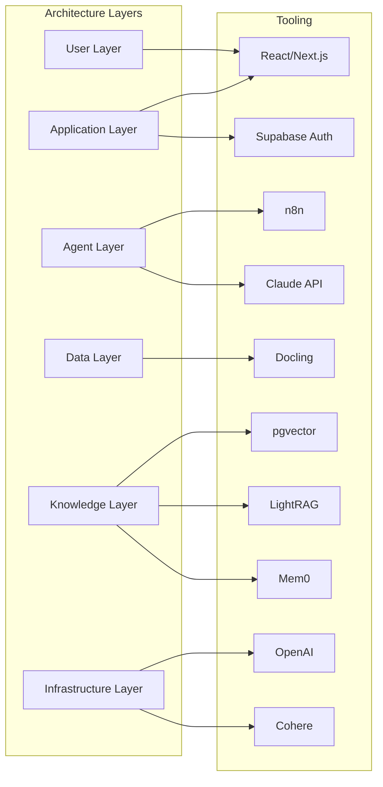

---

## MVP vs Scale Architecture

### MVP Architecture (Now)

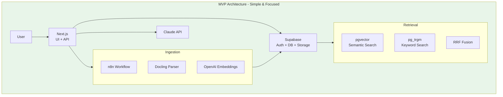

**MVP Characteristics:**
- ✅ Hybrid search (semantic + keyword)
- ✅ Basic query expansion (synonyms)
- ✅ Session-based memory
- ✅ Document metadata filtering
- ❌ No knowledge graph
- ❌ No cross-session memory
- ❌ No ontology reasoning

### Scale Architecture (Future)

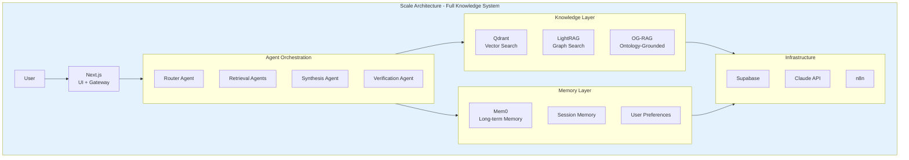

**Scale Characteristics:**
- ✅ Everything in MVP
- ✅ Multi-agent orchestration
- ✅ Knowledge graph (LightRAG)
- ✅ Ontology-grounded retrieval
- ✅ Long-term memory (Mem0)
- ✅ Dedicated vector DB (Qdrant)
- ✅ Verification/fact-checking

---

## Implementation Roadmap

### Phase 1: MVP Foundation (Weeks 1-4)

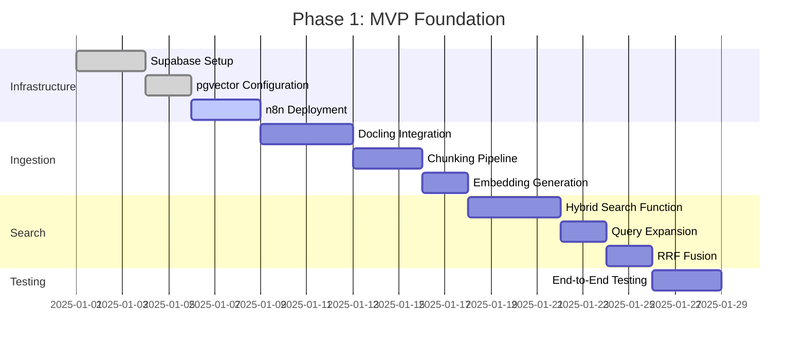

**Deliverables:**
- [ ] Document upload → storage → chunking → embedding pipeline
- [ ] Hybrid search with RRF fusion
- [ ] Basic query expansion (synonym dictionary)
- [ ] Chat interface with streaming
- [ ] Session-based conversation memory

### Phase 2: Enhanced Retrieval (Weeks 5-8)

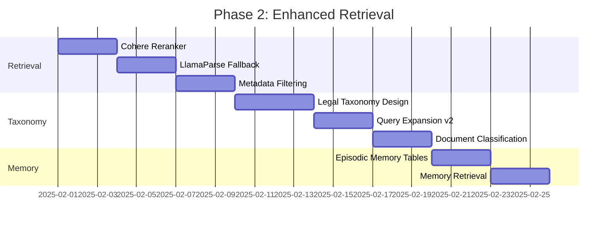

**Deliverables:**
- [ ] Reranking integration (Cohere)
- [ ] Multi-parser support (Docling + LlamaParse)
- [ ] Legal taxonomy for query expansion
- [ ] Document type classification
- [ ] Basic episodic memory (per-user history)

### Phase 3: Knowledge Graph (Weeks 9-12)

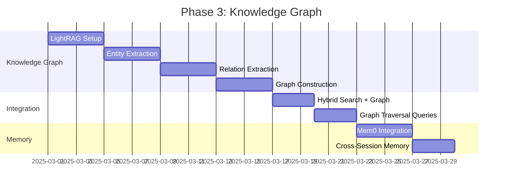

**Deliverables:**
- [ ] LightRAG integration
- [ ] Legal entity extraction (parties, clauses, obligations)
- [ ] Relation extraction (references, supersedes)
- [ ] Graph-augmented hybrid search
- [ ] Mem0 for long-term memory

### Phase 4: Full Knowledge System (Weeks 13-16)

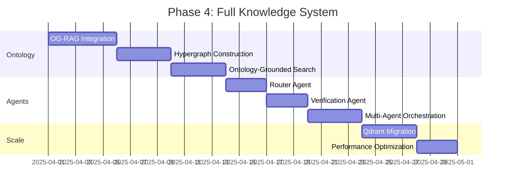

**Deliverables:**
- [ ] Ontology-grounded retrieval (OG-RAG pattern)
- [ ] Multi-agent query processing
- [ ] Verification/fact-checking agent
- [ ] Qdrant migration for scale
- [ ] Performance optimization

---

## Sources & References

### Academic Papers

| Paper | Year | Key Contribution |
|-------|------|------------------|
| [HybridRAG](https://arxiv.org/abs/2408.04948) | 2024 | Vector + Graph hybrid architecture |
| [OG-RAG](https://aclanthology.org/2025.emnlp-main.1674/) | 2025 | Ontology-grounded retrieval |
| [MemoRAG](https://arxiv.org/abs/2409.05591) | 2025 | Memory-augmented RAG |
| [Agentic RAG Survey](https://arxiv.org/abs/2501.09136) | 2025 | Multi-agent RAG architectures |
| [Legal KG Construction](https://www.mdpi.com/2078-2489/15/11/666) | 2024 | LLM-based legal knowledge graphs |
| [Mem0 Paper](https://arxiv.org/abs/2504.19413) | 2025 | Production memory systems |
| [LightRAG](https://arxiv.org/abs/2410.05779) | 2024 | Efficient graph RAG |

### Industry Resources

| Resource | Description |
|----------|-------------|
| [Neo4j KG vs Vector](https://neo4j.com/blog/developer/knowledge-graph-vs-vector-rag/) | Comprehensive comparison |
| [Docling Benchmark](https://procycons.com/en/blogs/pdf-data-extraction-benchmark/) | PDF parsing comparison |
| [Mem0 Documentation](https://docs.mem0.ai/) | Memory layer integration |
| [LlamaIndex Docs](https://docs.llamaindex.ai/) | RAG framework reference |

---

## Related Documents

- [System Architecture](./SYSTEM_ARCHITECTURE.md) - Overall system design
- [Memory Systems Research](../application/memory-systems/MEMORY_SYSTEMS_RESEARCH.md) - Memory implementation details
- [RAG Frameworks Comparison](../application/rag-frameworks/RAG_FRAMEWORKS_COMPARISON.md) - Framework evaluation
- [Migration Plan](./migrations/MIGRATION_PLAN.md) - Supabase migration steps
