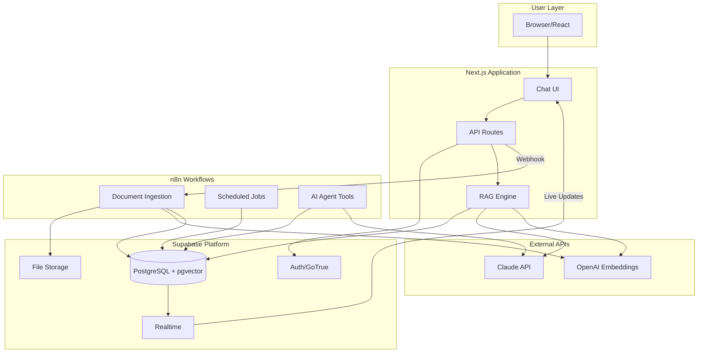
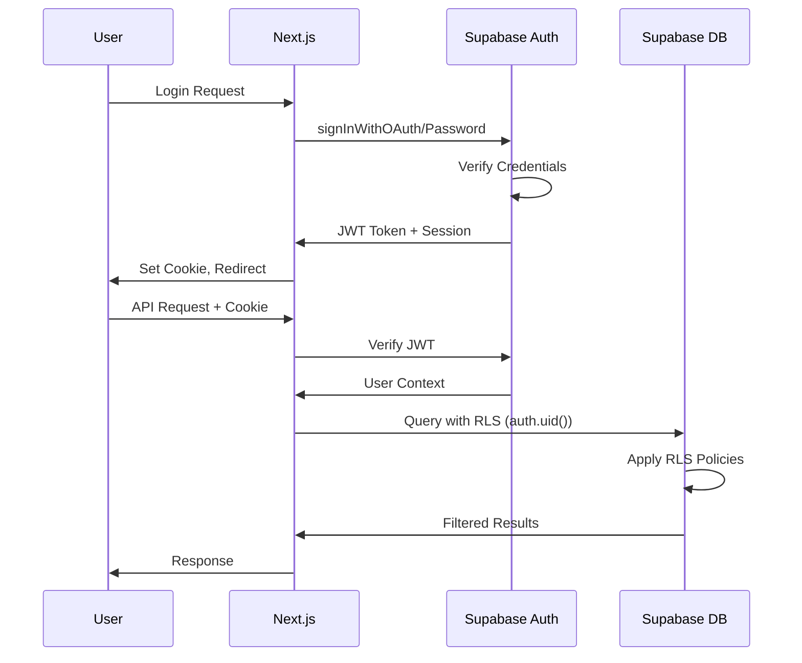
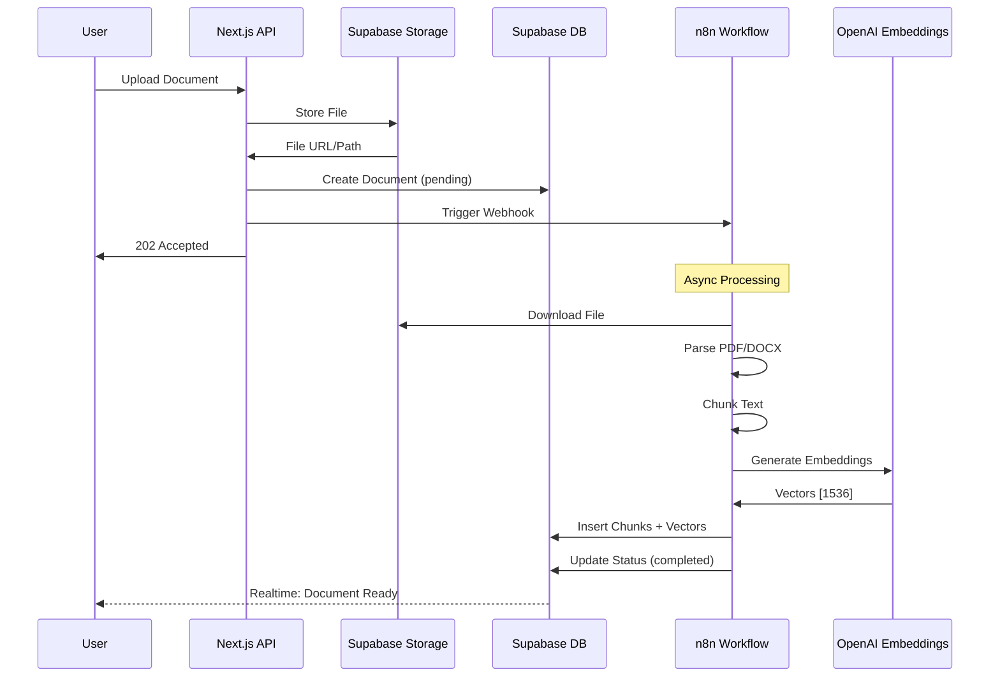
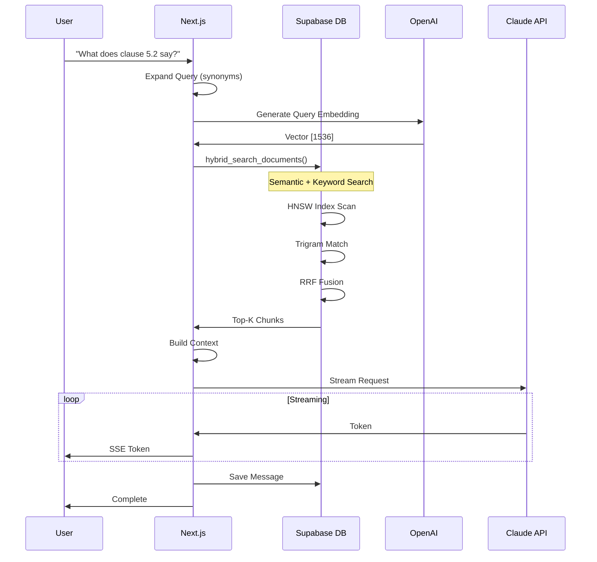

# Legal AI Assistant - System Architecture

**Version:** 2.0
**Date:** 2025-12-18
**Status:** Planning

---

## Table of Contents

1. [Architecture Overview](#architecture-overview)
2. [Component Responsibilities](#component-responsibilities)
3. [System Diagrams](#system-diagrams)
4. [Data Flow](#data-flow)
5. [Integration Points](#integration-points)
6. [Decision Log](#decision-log)

---

## Architecture Overview

The Legal AI Assistant uses a **hybrid architecture** with three main components:

| Component | Role | Why |
|-----------|------|-----|
| **Next.js** | Frontend + API Gateway | User interface, real-time chat, API routing |
| **Supabase** | Data Layer + Auth | Database, vectors, storage, authentication, RLS |
| **n8n** | Workflow Orchestration | Background processing, document ingestion, complex pipelines |

### High-Level Architecture

```
┌─────────────────────────────────────────────────────────────────────────────┐
│                              USER LAYER                                      │
├─────────────────────────────────────────────────────────────────────────────┤
│                                                                              │
│    ┌──────────────┐     ┌──────────────┐     ┌──────────────┐              │
│    │   Browser    │     │   Mobile     │     │   Slack/     │              │
│    │   (React)    │     │   (Future)   │     │   Teams      │              │
│    └──────┬───────┘     └──────┬───────┘     └──────┬───────┘              │
│           │                    │                    │                       │
└───────────┼────────────────────┼────────────────────┼───────────────────────┘
            │                    │                    │
            ▼                    ▼                    ▼
┌─────────────────────────────────────────────────────────────────────────────┐
│                           APPLICATION LAYER                                  │
├─────────────────────────────────────────────────────────────────────────────┤
│                                                                              │
│    ┌────────────────────────────────────────────────────────────────┐       │
│    │                      NEXT.JS APPLICATION                        │       │
│    │  ┌──────────────┐  ┌──────────────┐  ┌──────────────────────┐  │       │
│    │  │  App Router  │  │  API Routes  │  │  Server Components   │  │       │
│    │  │  (Pages)     │  │  /api/*      │  │  (SSR/RSC)           │  │       │
│    │  └──────────────┘  └──────┬───────┘  └──────────────────────┘  │       │
│    │                           │                                     │       │
│    │  ┌──────────────┐  ┌──────┴───────┐  ┌──────────────────────┐  │       │
│    │  │   Chat UI    │  │  RAG Engine  │  │  Document Manager    │  │       │
│    │  │  (Realtime)  │  │  (Query)     │  │  (Upload Handler)    │  │       │
│    │  └──────────────┘  └──────────────┘  └──────────────────────┘  │       │
│    └────────────────────────────────────────────────────────────────┘       │
│                                                                              │
└───────────────────────────────────────────────────────────────────────────────┘
            │                    │                    │
            ▼                    ▼                    ▼
┌─────────────────────────────────────────────────────────────────────────────┐
│                           ORCHESTRATION LAYER                                │
├─────────────────────────────────────────────────────────────────────────────┤
│                                                                              │
│    ┌────────────────────────────────────────────────────────────────┐       │
│    │                      N8N WORKFLOWS                              │       │
│    │  ┌──────────────┐  ┌──────────────┐  ┌──────────────────────┐  │       │
│    │  │  Document    │  │  Scheduled   │  │  Event-Driven        │  │       │
│    │  │  Ingestion   │  │  Jobs        │  │  Automations         │  │       │
│    │  └──────────────┘  └──────────────┘  └──────────────────────┘  │       │
│    │                                                                 │       │
│    │  ┌──────────────┐  ┌──────────────┐  ┌──────────────────────┐  │       │
│    │  │  AI Agent    │  │  Memory      │  │  Multi-Channel       │  │       │
│    │  │  Workflows   │  │  Management  │  │  Notifications       │  │       │
│    │  └──────────────┘  └──────────────┘  └──────────────────────┘  │       │
│    └────────────────────────────────────────────────────────────────┘       │
│                                                                              │
└───────────────────────────────────────────────────────────────────────────────┘
            │                    │                    │
            ▼                    ▼                    ▼
┌─────────────────────────────────────────────────────────────────────────────┐
│                              DATA LAYER                                      │
├─────────────────────────────────────────────────────────────────────────────┤
│                                                                              │
│    ┌────────────────────────────────────────────────────────────────┐       │
│    │                         SUPABASE                                │       │
│    │  ┌──────────────┐  ┌──────────────┐  ┌──────────────────────┐  │       │
│    │  │  PostgreSQL  │  │  Auth        │  │  Storage             │  │       │
│    │  │  + pgvector  │  │  (GoTrue)    │  │  (S3-compatible)     │  │       │
│    │  └──────────────┘  └──────────────┘  └──────────────────────┘  │       │
│    │                                                                 │       │
│    │  ┌──────────────┐  ┌──────────────┐  ┌──────────────────────┐  │       │
│    │  │  Realtime    │  │  Edge        │  │  Row Level           │  │       │
│    │  │  (WebSocket) │  │  Functions   │  │  Security            │  │       │
│    │  └──────────────┘  └──────────────┘  └──────────────────────┘  │       │
│    └────────────────────────────────────────────────────────────────┘       │
│                                                                              │
└───────────────────────────────────────────────────────────────────────────────┘
            │
            ▼
┌─────────────────────────────────────────────────────────────────────────────┐
│                           EXTERNAL SERVICES                                  │
├─────────────────────────────────────────────────────────────────────────────┤
│                                                                              │
│    ┌──────────────┐  ┌──────────────┐  ┌──────────────────────────┐         │
│    │  Anthropic   │  │  OpenAI      │  │  Abacus.AI             │         │
│    │  Claude API  │  │  Embeddings  │  │  (Backup LLM)          │         │
│    └──────────────┘  └──────────────┘  └──────────────────────────┘         │
│                                                                              │
└─────────────────────────────────────────────────────────────────────────────┘
```

---

## Component Responsibilities

### What Supabase Handles (Data Layer)

| Capability | Details | Why Supabase? |
|------------|---------|---------------|
| **Authentication** | User signup, login, OAuth, sessions | Built-in GoTrue, JWT tokens, RLS integration |
| **Database** | All structured data storage | PostgreSQL with pgvector, ACID compliance |
| **Vector Storage** | Embeddings for semantic search | Native pgvector 0.8.0, HNSW indexes |
| **File Storage** | Document files (PDF, DOCX) | S3-compatible, integrated with auth |
| **Row Level Security** | Multi-tenant data isolation | Automatic per-user data access |
| **Realtime** | Live updates, presence | WebSocket subscriptions |
| **Edge Functions** | Lightweight serverless logic | For webhooks, simple transforms |

#### Supabase Tables

```
┌─────────────────────────────────────────────────────────────────┐
│                      SUPABASE SCHEMA                             │
├─────────────────────────────────────────────────────────────────┤
│                                                                  │
│  auth.users (built-in)                                          │
│       │                                                          │
│       ▼                                                          │
│  ┌─────────────┐                                                │
│  │  profiles   │ ◄─── User metadata, preferences                │
│  └──────┬──────┘                                                │
│         │                                                        │
│    ┌────┴────┐                                                  │
│    ▼         ▼                                                  │
│  ┌─────────────┐    ┌───────────────┐                          │
│  │  documents  │    │ chat_sessions │                          │
│  └──────┬──────┘    └───────┬───────┘                          │
│         │                   │                                    │
│         ▼                   ▼                                    │
│  ┌─────────────────┐  ┌──────────┐                              │
│  │ document_chunks │  │ messages │                              │
│  │   (+ vectors)   │  └──────────┘                              │
│  └─────────────────┘                                            │
│                                                                  │
│  storage.buckets                                                │
│       │                                                          │
│       ▼                                                          │
│  ┌─────────────────┐                                            │
│  │ legal-documents │ ◄─── PDF, DOCX files                       │
│  └─────────────────┘                                            │
│                                                                  │
└─────────────────────────────────────────────────────────────────┘
```

---

### What n8n Handles (Orchestration Layer)

| Capability | Details | Why n8n? |
|------------|---------|----------|
| **Document Ingestion** | PDF parsing, chunking, embedding | Long-running, CPU-intensive |
| **Background Jobs** | Reindexing, cleanup, maintenance | Scheduled, async processing |
| **Complex Workflows** | Multi-step AI pipelines | Visual debugging, retry logic |
| **External Integrations** | Email, Slack, calendar | 500+ native connectors |
| **AI Agent Tools** | Custom tools for Claude | Modular, reusable workflows |
| **Event Processing** | React to Supabase changes | Webhook triggers |

#### n8n Workflow Types

```
┌─────────────────────────────────────────────────────────────────┐
│                      N8N WORKFLOWS                               │
├─────────────────────────────────────────────────────────────────┤
│                                                                  │
│  1. DOCUMENT INGESTION WORKFLOW                                 │
│  ┌─────────────────────────────────────────────────────────┐    │
│  │  Webhook ──► Validate ──► Download ──► Parse PDF        │    │
│  │      │                                    │              │    │
│  │      │                                    ▼              │    │
│  │      │                              Chunk Text           │    │
│  │      │                                    │              │    │
│  │      │                                    ▼              │    │
│  │      │                           Generate Embeddings     │    │
│  │      │                                    │              │    │
│  │      │                                    ▼              │    │
│  │      │                           Store in Supabase       │    │
│  │      │                                    │              │    │
│  │      └─────────────────────────────────── ▼              │    │
│  │                                    Update Status          │    │
│  └─────────────────────────────────────────────────────────┘    │
│                                                                  │
│  2. SCHEDULED MAINTENANCE WORKFLOW                              │
│  ┌─────────────────────────────────────────────────────────┐    │
│  │  Cron ──► Find Stale Docs ──► Re-embed ──► Cleanup      │    │
│  └─────────────────────────────────────────────────────────┘    │
│                                                                  │
│  3. AI AGENT TOOLS WORKFLOW                                     │
│  ┌─────────────────────────────────────────────────────────┐    │
│  │  Webhook ──► AI Agent ──► Tool Selection ──► Execute    │    │
│  │                              │                           │    │
│  │                    ┌─────────┼─────────┐                │    │
│  │                    ▼         ▼         ▼                │    │
│  │               [Search]  [Analyze]  [Summarize]          │    │
│  └─────────────────────────────────────────────────────────┘    │
│                                                                  │
│  4. NOTIFICATION WORKFLOW                                       │
│  ┌─────────────────────────────────────────────────────────┐    │
│  │  Supabase Trigger ──► Format ──► Send Email/Slack       │    │
│  └─────────────────────────────────────────────────────────┘    │
│                                                                  │
└─────────────────────────────────────────────────────────────────┘
```

---

### What Next.js Handles (Application Layer)

| Capability | Details | Why Next.js? |
|------------|---------|--------------|
| **User Interface** | React components, chat UI | Modern React, SSR/RSC |
| **API Gateway** | Route requests, auth middleware | Edge runtime, API routes |
| **Real-time Chat** | Streaming responses | Server-sent events |
| **RAG Queries** | Fast semantic search | Direct Supabase queries |
| **Session Management** | Client state, cookies | Supabase Auth helpers |

#### Next.js Request Flow

```
┌─────────────────────────────────────────────────────────────────┐
│                     NEXT.JS REQUEST FLOWS                        │
├─────────────────────────────────────────────────────────────────┤
│                                                                  │
│  REAL-TIME CHAT (Synchronous - stays in Next.js)                │
│  ┌─────────────────────────────────────────────────────────┐    │
│  │  User Query                                              │    │
│  │      │                                                   │    │
│  │      ▼                                                   │    │
│  │  /api/chat/route.ts                                      │    │
│  │      │                                                   │    │
│  │      ├──► Auth Check (Supabase)                         │    │
│  │      │                                                   │    │
│  │      ├──► Generate Query Embedding (OpenAI)             │    │
│  │      │                                                   │    │
│  │      ├──► Hybrid Search (Supabase pgvector)             │    │
│  │      │                                                   │    │
│  │      ├──► Build Context from Chunks                     │    │
│  │      │                                                   │    │
│  │      ├──► Stream Response (Claude API)                  │    │
│  │      │                                                   │    │
│  │      └──► Save to chat_sessions (Supabase)              │    │
│  └─────────────────────────────────────────────────────────┘    │
│                                                                  │
│  DOCUMENT UPLOAD (Async - offload to n8n)                       │
│  ┌─────────────────────────────────────────────────────────┐    │
│  │  File Upload                                             │    │
│  │      │                                                   │    │
│  │      ▼                                                   │    │
│  │  /api/documents/upload/route.ts                          │    │
│  │      │                                                   │    │
│  │      ├──► Auth Check (Supabase)                         │    │
│  │      │                                                   │    │
│  │      ├──► Upload to Storage (Supabase)                  │    │
│  │      │                                                   │    │
│  │      ├──► Create Document Record (status: pending)      │    │
│  │      │                                                   │    │
│  │      ├──► Trigger n8n Webhook ─────────────────────┐    │    │
│  │      │                                              │    │    │
│  │      └──► Return Immediately (202 Accepted)         │    │    │
│  │                                                     │    │    │
│  │  [n8n processes async]◄─────────────────────────────┘    │    │
│  │      │                                                   │    │
│  │      └──► Updates document status in Supabase           │    │
│  └─────────────────────────────────────────────────────────┘    │
│                                                                  │
└─────────────────────────────────────────────────────────────────┘
```

---

## System Diagrams

### Complete Data Flow Diagram



### Authentication Flow



### Document Upload & Processing Flow



### RAG Query Flow



---

## Integration Points

### 1. Next.js ↔ Supabase

```typescript
// Connection: @supabase/ssr + @supabase/supabase-js

// Server Component
import { createServerClient } from '@supabase/ssr'

// API Route
import { createClient } from '@supabase/supabase-js'

// Client Component
import { createBrowserClient } from '@supabase/ssr'
```

**Data Exchange:**
- REST API (PostgREST)
- Realtime WebSocket
- Storage API (S3-compatible)

### 2. Next.js ↔ n8n

```typescript
// Trigger n8n workflow via webhook
await fetch(`${N8N_WEBHOOK_URL}/document-process`, {
  method: 'POST',
  headers: {
    'Content-Type': 'application/json',
    'X-N8N-API-KEY': process.env.N8N_API_KEY
  },
  body: JSON.stringify({
    documentId,
    userId,
    storagePath
  })
})
```

**Data Exchange:**
- HTTP Webhooks (Next.js → n8n)
- Supabase Database (shared state)
- Supabase Realtime (status updates)

### 3. n8n ↔ Supabase

```
n8n Nodes Used:
- Supabase Node (CRUD operations)
- Postgres Node (vector queries, custom SQL)
- HTTP Request Node (Storage API)
```

**Data Exchange:**
- Direct PostgreSQL connection
- Supabase REST API
- Storage presigned URLs

### 4. External API Connections

| Service | Used By | Purpose |
|---------|---------|---------|
| **Claude API** | Next.js, n8n | LLM responses |
| **OpenAI API** | Next.js, n8n | Embeddings generation |
| **Abacus.AI** | n8n (fallback) | Backup LLM |

---

## Decision Log

### ADR-001: Use Supabase for Auth Instead of NextAuth

**Decision:** Migrate from NextAuth.js to Supabase Auth

**Reasons:**
1. Unified platform (auth + db + storage)
2. Built-in RLS integration with `auth.uid()`
3. OAuth providers out of the box
4. No custom session management needed

**Trade-offs:**
- Vendor lock-in to Supabase
- Less customization than NextAuth

---

### ADR-002: Use pgvector Instead of Dedicated Vector DB

**Decision:** Use Supabase's built-in pgvector instead of Qdrant/Pinecone

**Reasons:**
1. Single database for all data
2. Simpler architecture
3. HNSW indexes perform well up to 1M vectors
4. Native RLS for vector data

**Trade-offs:**
- May need dedicated vector DB at scale (>1M docs)
- Less advanced vector search features

---

### ADR-003: Offload Document Processing to n8n

**Decision:** Use n8n for document ingestion, not Next.js API routes

**Reasons:**
1. Long-running tasks (PDF parsing, embedding generation)
2. Visual debugging and monitoring
3. Retry logic built-in
4. No serverless timeout issues
5. Background processing doesn't block UI

**Trade-offs:**
- Additional infrastructure (n8n server)
- Webhook latency vs direct processing

---

### ADR-004: Keep RAG Queries in Next.js

**Decision:** Real-time RAG queries stay in Next.js API routes

**Reasons:**
1. Low latency requirement (<2s response)
2. Streaming responses (SSE)
3. Direct Supabase connection
4. No n8n overhead for simple queries

**Trade-offs:**
- Less visual debugging than n8n
- Must optimize for serverless timeout

---

## Next Steps

1. [ ] Apply Supabase migrations (see `migrations/` folder)
2. [ ] Set up n8n instance (self-hosted or cloud)
3. [ ] Create n8n webhook credentials
4. [ ] Build document ingestion workflow
5. [ ] Update Next.js to use Supabase Auth
6. [ ] Test end-to-end flow

---

## Related Documents

- [Migration Plan](./migrations/MIGRATION_PLAN.md)
- [n8n Workflow Specifications](./n8n/WORKFLOW_SPECS.md)
- [API Specifications](./api/API_SPECS.md)
