# Architecture Diagrams (Mermaid)

**Version:** 1.0
**Date:** 2025-12-18

Copy these diagrams into any Mermaid renderer (GitHub, Notion, Mermaid Live Editor, etc.)

---

## 1. High-Level System Architecture

---

## 2. Document Upload & Processing Flow

```mermaid
sequenceDiagram
    autonumber
    participant U as 👤 User
    participant N as ⚛️ Next.js
    participant S as 🟢 Supabase Storage
    participant D as 🟢 Supabase DB
    participant W as 🔄 n8n Workflow
    participant E as 🌐 OpenAI

    U->>N: Upload Document (PDF)
    activate N
    N->>S: Store File
    S-->>N: Storage Path
    N->>D: INSERT document (status: pending)
    D-->>N: Document ID
    N->>W: POST /webhook/ingest
    Note over N,W: Fire & Forget (async)
    N-->>U: 202 Accepted
    deactivate N

    activate W
    Note over W: Background Processing
    W->>D: UPDATE status = 'processing'
    W->>S: Download File
    S-->>W: File Binary
    W->>W: Parse PDF → Text
    W->>W: Chunk Text (1000 chars)

    loop For each chunk
        W->>E: Generate Embedding
        E-->>W: Vector [1536]
    end

    W->>D: BATCH INSERT chunks + vectors
    W->>D: UPDATE status = 'completed'
    deactivate W

    D-->>U: 🔔 Realtime: Document Ready!
```

---

## 3. RAG Query Flow

```mermaid
sequenceDiagram
    autonumber
    participant U as 👤 User
    participant N as ⚛️ Next.js /api/chat
    participant D as 🟢 Supabase DB
    participant E as 🌐 OpenAI
    participant C as 🌐 Claude API

    U->>N: "What does clause 5.2 say?"
    activate N

    N->>N: Auth Check (JWT)
    N->>N: Query Expansion

    N->>E: Generate Embedding
    E-->>N: Vector [1536]

    N->>D: hybrid_search_documents()
    activate D
    Note over D: 1. HNSW Vector Search<br/>2. Trigram Text Search<br/>3. RRF Fusion
    D-->>N: Top 10 Chunks
    deactivate D

    N->>N: Build Context Prompt

    N->>C: Stream Request
    activate C

    loop Streaming Response
        C-->>N: Token
        N-->>U: SSE Token
    end
    deactivate C

    N->>D: Save Message
    N-->>U: [DONE]
    deactivate N
```

---

## 4. Authentication Flow

```mermaid
sequenceDiagram
    autonumber
    participant U as 👤 User
    participant B as 🌐 Browser
    participant N as ⚛️ Next.js
    participant A as 🟢 Supabase Auth
    participant D as 🟢 Supabase DB

    U->>B: Click "Sign In with Google"
    B->>A: OAuth Request
    A->>A: Redirect to Google
    Note over A: Google OAuth Flow
    A-->>B: JWT + Refresh Token
    B->>B: Store in Cookie

    U->>B: Make API Request
    B->>N: Request + Cookie
    N->>A: Verify JWT
    A-->>N: User Context (auth.uid())

    N->>D: Query with RLS
    Note over D: WHERE user_id = auth.uid()<br/>Applied automatically
    D-->>N: Filtered Data
    N-->>B: Response
    B-->>U: Display Data
```

---

## 5. Database Schema (ER Diagram)

---

## 6. n8n Workflow Architecture

---

## 7. Component Interaction Overview

```mermaid
graph TB
    subgraph Client["Client Layer"]
        Browser["🌐 Browser (React)"]
    end

    subgraph App["Application Layer"]
        NextJS["⚛️ Next.js"]
    end

    subgraph Orchestration["Orchestration Layer"]
        N8N["🔄 n8n"]
    end

    subgraph Data["Data Layer"]
        Supabase["🟢 Supabase"]
    end

    subgraph External["External Services"]
        LLM["🤖 LLM APIs"]
    end

    Browser <-->|"HTTP/WebSocket"| NextJS
    NextJS <-->|"REST/RLS"| Supabase
    NextJS -->|"Webhook"| N8N
    NextJS <-->|"Streaming"| LLM
    N8N <-->|"REST/SQL"| Supabase
    N8N <-->|"API"| LLM
    Supabase -->|"Realtime"| Browser

    style Client fill:#e3f2fd
    style App fill:#f3e5f5
    style Orchestration fill:#fff3e0
    style Data fill:#e8f5e9
    style External fill:#fce4ec
```

---

## 8. Hybrid Search Flow

---

## 9. Deployment Architecture

```mermaid
graph TB
    subgraph Internet["🌐 Internet"]
        Users[Users]
    end

    subgraph Vercel["☁️ Vercel"]
        NextJS[Next.js App<br/>Edge + Serverless]
    end

    subgraph N8N_Host["☁️ n8n Host"]
        N8N[n8n Server<br/>Self-hosted or Cloud]
    end

    subgraph Supabase_Cloud["☁️ Supabase Cloud"]
        SB_Edge[Edge Functions]
        SB_Auth[Auth Service]
        SB_API[PostgREST API]
        SB_RT[Realtime Service]
        SB_DB[(PostgreSQL)]
        SB_Storage[Object Storage]
    end

    subgraph APIs["🌐 External APIs"]
        Anthropic[Anthropic API]
        OpenAI[OpenAI API]
    end

    Users --> NextJS
    NextJS --> SB_Auth
    NextJS --> SB_API
    NextJS --> Anthropic
    NextJS --> OpenAI
    NextJS -.->|Webhook| N8N

    N8N --> SB_API
    N8N --> SB_Storage
    N8N --> OpenAI

    SB_API --> SB_DB
    SB_RT --> SB_DB
    SB_Auth --> SB_DB
```

---

## 10. Data Flow Summary

```mermaid
flowchart LR
    subgraph Input["📥 Input"]
        DOC[Document Upload]
        MSG[Chat Message]
    end

    subgraph Process["⚙️ Process"]
        N8N_P[n8n: Parse & Embed]
        NJS_P[Next.js: Query & Stream]
    end

    subgraph Store["💾 Store"]
        VEC[(Vectors)]
        TXT[(Text/Metadata)]
        FILES[(Files)]
    end

    subgraph Output["📤 Output"]
        RESP[AI Response]
        NOTIFY[Notifications]
    end

    DOC --> N8N_P
    N8N_P --> VEC
    N8N_P --> TXT
    N8N_P --> FILES
    N8N_P --> NOTIFY

    MSG --> NJS_P
    VEC --> NJS_P
    TXT --> NJS_P
    NJS_P --> RESP
```

---

## How to Use These Diagrams

### GitHub
GitHub renders Mermaid diagrams automatically in markdown files.

### Notion
Notion supports Mermaid in code blocks with language set to `mermaid`.

### Mermaid Live Editor
Visit https://mermaid.live and paste any diagram code.

### VS Code
Install the "Mermaid Preview" extension to view diagrams inline.

### Export Options
- PNG/SVG: Use Mermaid Live Editor export
- PDF: Render in browser, print to PDF
