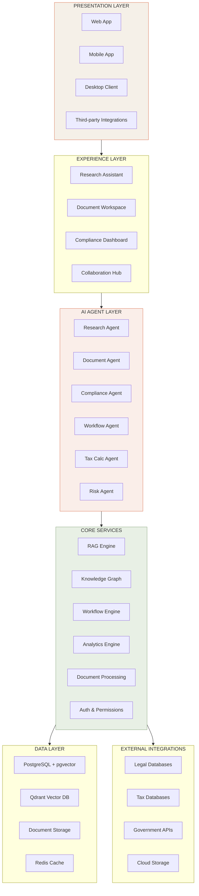
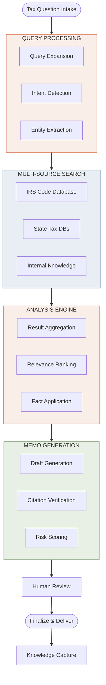
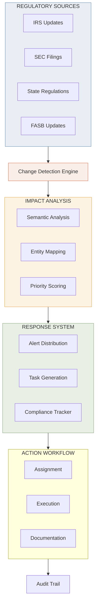
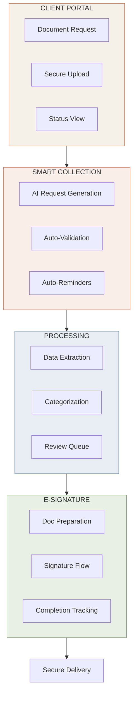
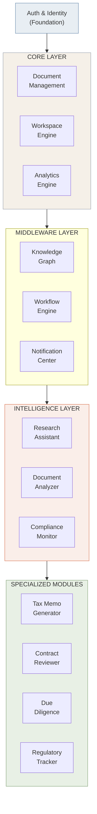
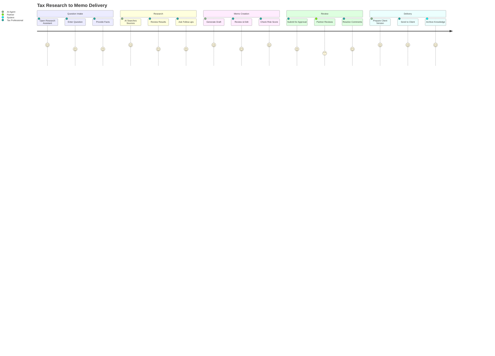
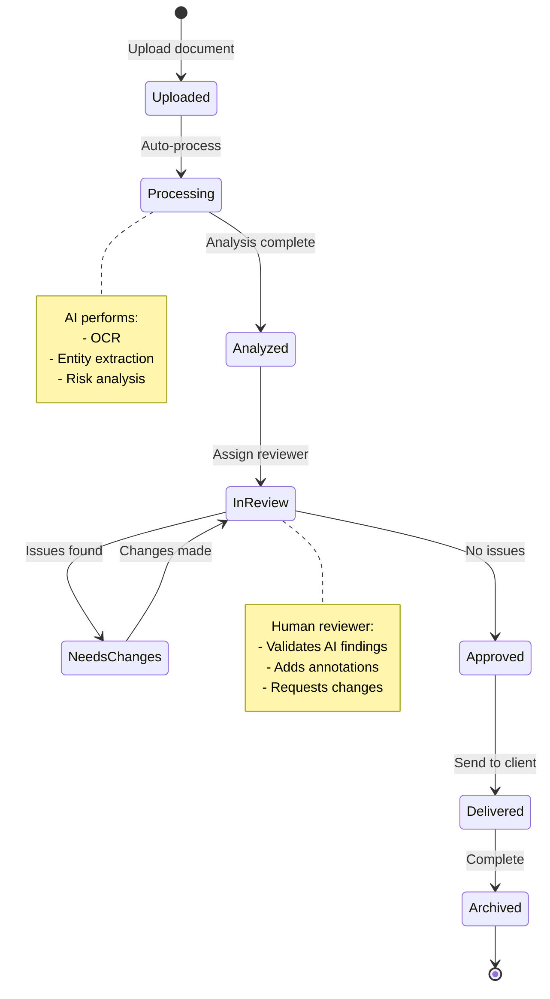
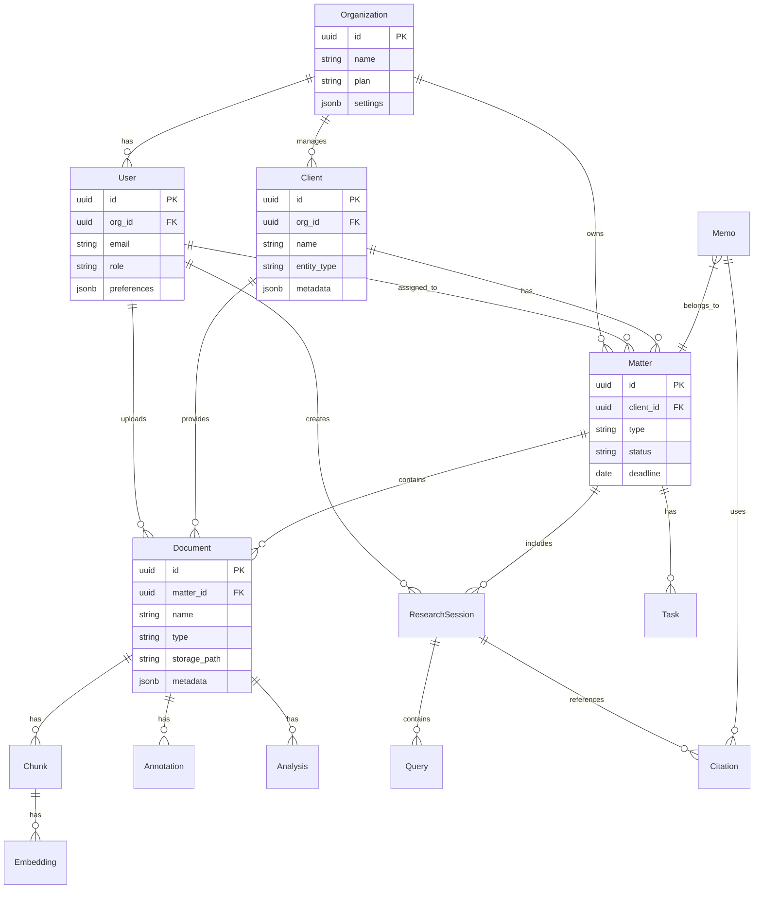

# Platform Diagrams
## Mermaid Format (GitHub/Markdown Compatible)

---

## 1. High-Level Platform Architecture

---

## 2. Tax Research Workflow

---

## 3. Document Analysis Flow

```mermaid
flowchart LR
    subgraph Ingest["INGESTION"]
        Upload["Upload"]
        OCR["OCR Processing"]
        Format["Format Detection"]
    end

    subgraph Analyze["AI ANALYSIS"]
        Clause["Clause Extraction"]
        Entity["Entity Recognition"]
        Risk["Risk Analysis"]
    end

    subgraph Output["OUTPUTS"]
        Summary["Summary View"]
        Issues["Issue List"]
        Compare["Comparison"]
    end

    subgraph Collab["COLLABORATION"]
        Annotate["Annotations"]
        Review["Review Workflow"]
        Approve["Approval"]
    end

    Ingest --> Analyze
    Analyze --> Output
    Output --> Collab

    style Ingest fill:#E8EEF3,stroke:#6B8CAE
    style Analyze fill:#FAEEE9,stroke:#DA7756
    style Output fill:#F5F0E8,stroke:#9CA3AF
    style Collab fill:#E8F0E5,stroke:#88A47C
```

---

## 4. Compliance Monitoring Flow

---

## 5. Client Collaboration Flow

---

## 6. Module Dependencies

---

## 7. User Journey: Tax Research to Memo

---

## 8. State Machine: Document Review

---

## 9. Data Flow: RAG System

```mermaid
flowchart LR
    subgraph Input["INPUT"]
        Query["User Query"]
        Context["Context"]
    end

    subgraph Process["PROCESSING"]
        Expand["Query Expansion"]
        Embed["Embedding Generation"]
    end

    subgraph Search["HYBRID SEARCH"]
        Semantic["Semantic Search<br/>(Vector)"]
        Keyword["Keyword Search<br/>(BM25)"]
        Fusion["RRF Fusion"]
    end

    subgraph Retrieval["RETRIEVAL"]
        TopK["Top-K Selection"]
        Rerank["Re-ranking"]
        Filter["Context Filtering"]
    end

    subgraph Generation["GENERATION"]
        LLM["LLM Processing"]
        Citation["Citation Extraction"]
        Response["Response Assembly"]
    end

    Input --> Process
    Process --> Search
    Search --> Retrieval
    Retrieval --> Generation

    style Process fill:#FAEEE9,stroke:#DA7756
    style Search fill:#E8EEF3,stroke:#6B8CAE
    style Generation fill:#E8F0E5,stroke:#88A47C
```

---

## 10. Entity Relationship: Core Data Model

---

## View in Draw.io

To view these diagrams in draw.io:

1. Go to [draw.io](https://app.diagrams.net/)
2. Create a new diagram
3. Use the "Arrange" > "Insert" > "Advanced" > "Mermaid" option
4. Paste the mermaid code blocks

Alternatively, use the draw.io XML file: [PLATFORM_DIAGRAMS.drawio](PLATFORM_DIAGRAMS.drawio)

---

## Automation Opportunity Annotations

### Legend

| Symbol | Meaning | Impact |
|--------|---------|--------|
| 🔥 | Critical automation opportunity | 80%+ time savings |
| ⚡ | High-value automation | 60-80% time savings |
| 🎯 | Targeted automation | 40-60% time savings |
| 💡 | Enhancement opportunity | 20-40% time savings |

### Key Automation Points

| Flow | Step | Opportunity | Impact |
|------|------|-------------|--------|
| Tax Research | Query Processing | 🔥 AI-powered query expansion | 80% faster |
| Tax Research | Multi-source Search | 🔥 Parallel automated search | 90% faster |
| Tax Research | Memo Generation | ⚡ AI draft generation | 70% faster |
| Document Review | Ingestion | 🔥 Auto-processing pipeline | 85% faster |
| Document Review | Analysis | 🔥 AI clause extraction | 75% faster |
| Compliance | Monitoring | 🔥 24/7 automated monitoring | 95% coverage |
| Compliance | Impact Analysis | ⚡ AI entity mapping | 80% faster |
| Client Portal | Document Collection | ⚡ Smart requests + reminders | 60% faster |
| Client Portal | Validation | 🎯 Auto-validation | 50% faster |
